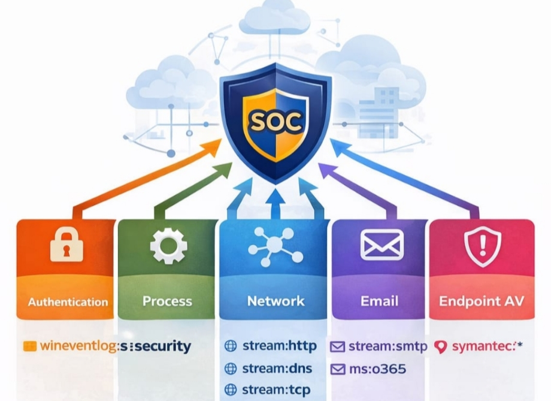

# 🔥 Splunk SOC Lab – Detection Engineering Project

This project simulates a real-world **Blue Team / SOC Investigation** using **BOTS v3 dataset**

The objective was to **analyze attacker** activity across the environment, **build detection use cases**, map them to **MITRE ATT&CK**, and **create alerts** and **dashboards** as if operating in a production SOC.
---------------------------------------------------------------------------------------------------------------------------------------------------------------------------------------------------------
The lab includes:

- Log analysis
- Threat hunting
- SPL detection engineering
- Alert configuration
- MITRE ATT&CK mapping
- Security impact documentation
- Incident response guidance
- Dashboard development

All execution evidence (screenshots) is stored in:
`/evidence/`

---

## 🚀 **Project Architecture**



🏗️ **Environment**

- SIEM: Splunk Enterprise
- Dataset: BOTS v3
- Log Sources:
  - Windows Security Logs
  - Sysmon
  - DNS Logs
  - Web Logs
  - Endpoint Logs

---

## 🧠 **Technology Stack**


## 1️⃣ Brute Force – Single Account


```bash

index=botsv3 EventCode=4625 earliest=-5m
| stats count by Account_Name src_ip
| where count > 15 

```
## 2️⃣ Password Spray (Single IP → Many Accounts)


```bash

index=botsv3 EventCode=4625 earliest=-5m
| stats dc(Account_Name) as unique_users count by src_ip
| where unique_users > 15

```
## 3️⃣ Brute Force Followed by Success


```bash

index=botsv3 (EventCode=4625 OR EventCode=4624) earliest=-10m
| stats 
    count(eval(EventCode=4625)) as failures
    count(eval(EventCode=4624)) as success
    by Account_Name src_ip
| where failures > 10 AND success > 0

```
## 4️⃣ Account Lockout Spike


```bash

index=botsv3 EventCode=4740 earliest=-10m
| stats count by Account_Name
| where count > 3

```
## 5️⃣ User Added to Local Admin Group


```bash

index=botsv3 EventCode=4732
| search Group_Name="*Administrators*"

```

## 6️⃣ Domain Admin Group Modification


```bash

index=botsv3 EventCode=4728
| search Group_Name="*Domain Admins*"

```

## 8️⃣ Special Privileges Assigned (4672)

```bash

index=botsv3 EventCode=4672
| search Account_Name!="SYSTEM"

```
## 9️⃣ New Account Creation

```bash

index=botsv3 EventCode=4720

```
## 🔟 Service Installation

```bash

index=botsv3 EventCode=7045

```
## 1️⃣1️⃣ Scheduled Task Creation

```bash

index=botsv3 EventCode=7045

```

## 1️⃣2️⃣ RDP Logon Spike
```bash

index=botsv3 EventCode=4624 Logon_Type=10 earliest=-10m
| stats count by src_ip
| where count > 15

```

## 1️⃣3️⃣ Lateral Movement


```bash

index=botsv3 EventCode=4624 Logon_Type=3
| stats dc(ComputerName) as hosts by Account_Name
| where hosts > 4

```
## 1️⃣4️⃣ DNS High Volume

```bash

index=botsv3 sourcetype=stream:dns earliest=-5m
| stats count by src_ip
| where count > 300

```
## 1️⃣5️⃣ Rare Domain Contact

```bash

index=botsv3 sourcetype=stream:dns
| stats count by query
| where count < 5

```
## 1️⃣6️⃣ NTLM Spike Attempts 

```bash

index=botsv3 EventCode=4776 earliest=-5m
| stats count dc(Account_Name) as users by src_ip
| where count > 30 AND users > 10

```
## 1️⃣7️⃣ Multiple IP Login Per Account 

```bash

index=botsv3 EventCode=4624 earliest=-24h
| stats dc(src_ip) as ips by Account_Name
| where ips > 5

```

## 1️⃣8️⃣ High Risk Users

```bash

index=botsv3 
| eval risk_score=case(
    EventCode=4625,30,
    EventCode=4672,60,
    EventCode=4688 AND like(Command_Line,"%lsass%"),80,
    EventCode=7045,70,
    1=1,0
)
| stats sum(risk_score) as risk by Account_Name
| where risk > 0
| search NOT Account_Name IN ("SYSTEM","NETWORK SERVICE","LOCAL SERVICE","DWM-1")
| sort -risk
| head 10

```

## 1️⃣9️⃣ Admin Access Attempts

```bash

index=botsv3 sourcetype=stream:http uri_path="/admin*"
| eval Result=case(
    status=200,"SUCCESS",
    status=401 OR status=403,"BLOCKED",
    status=404,"NOT_FOUND",
    status=500 OR status=503,"SERVER_ERROR",
    1=1,"OTHER")
| stats count by Result

```
## 2️⃣0️⃣ Power Shell Execution BY User

```bash

index=botsv3 EventCode=4688 New_Process_Name="*powershell*"
| stats count by Account_Name

```
## 2️⃣1️⃣ Suspicious Process Creation

```bash

index=botsv3 EventCode=4688
| eval ProcessName=lower(mvindex(split(New_Process_Name,"\\"),-1))
| stats count as ExecutionCount by ProcessName
| sort -ExecutionCount
| head 10

```
## 2️⃣2️⃣ Web Enumeration Activity

```bash

index=botsv3 sourcetype=stream:http status=404
| stats count by dest_ip | sort -count
| head 10

```
## 2️⃣3️⃣ Privileged Account Activity (Non-System) 

```bash

index=botsv3 EventCode=4672
| where NOT match(Account_Name,"^(SYSTEM|LOCAL SERVICE|NETWORK SERVICE|DWM-)")
| stats count as privilege_events by Account_Name, ComputerName
| sort -privilege_events
| head 10

```

## 2️⃣4️⃣ Administrative Group Changes

```bash

index=botsv3 EventCode=4728 OR EventCode=4732
| table _time Account_Name

```
## 2️⃣5️⃣ Total Risk Score 

```bash

index=botsv3
| eval risk_score=case(
    EventCode=4625,30,
    EventCode=4672,60,
    EventCode=4688 AND like(Command_Line,"%lsass%"),80,
    EventCode=7045,70,
    sourcetype="stream:http" AND bytes_out>10000000,90,
    1=1,0
)
| stats sum(risk_score) as risk by Account_Name
| stats sum(risk) as "Total Risk Score"

```
## 2️⃣6️⃣ Total 100% CPU Events


```bash

index=botsv3 sourcetype="perfmonmk:process" "%_Processor_Time"=100
| stats count

```

## 2️⃣7️⃣ AWS IAM Activity

```bash

	index=botsv3 sourcetype=aws:cloudtrail | search eventName=AttachUserPolicy OR eventName=CreateAccessKey OR eventName=DeleteUser OR eventName=ConsoleLogin


```
## 2️⃣8️⃣ AWS API WithOut MFA 

```bash

index=botsv3 sourcetype="aws:cloudtrail"
userIdentity.type=IAMUser
userIdentity.sessionContext.attributes.mfaAuthenticated=false
| stats count by userIdentity.userName eventName sourceIPAddress
| sort -count

```
## 2️⃣9️⃣ Public S3 Bucket Count

```bash

index=botsv3 sourcetype="aws:cloudtrail"
eventName=PutBucketAcl
requestParameters.AccessControlPolicy.AccessControlList.Grant{}.Grantee.URI="http://acs.amazonaws.com/groups/global/AllUsers"
| stats count

```
## 3️⃣0️⃣ Service Installation on System


```bash

index=botsv3 EventCode=7045
| table _time Service_Name 

```
## 3️⃣1️⃣ High SMTP Activity

```bash

index=botsv3 sourcetype=stream:smtp 
| stats count by src_ip | where count > 5
| sort -count 

```

## 3️⃣2️⃣ High CPU Process Activity

```bash

index=botsv3 sourcetype="perfmonmk:process" "%_Processor_Time"=100
| stats count by host instance
| sort -count

```
## 3️⃣3️⃣ Potential Data Exfilteration (HTTP Outilers) 

```bash
index=botsv3 sourcetype=stream:http 
| stats sum(bytes_out) as total_out by src_ip
| eventstats perc90(total_out) as threshold
| where total_out > threshold
| sort -total_out

```
## 3️⃣4️⃣ Lateral Movement Attempts 

```bash

index=botsv3 (EventCode=4624 OR EventCode=4672) earliest=-30m
| stats dc(ComputerName) as hosts by Account_Name
| where hosts > 3

```


---

## 🎯 **Correlation Rules**

🔴 1️⃣ `Brute Force → Successful Login → Privilege Assigned`
Attack Pattern:
Password guessing → success → admin privileges

``` bash
index=botsv3 (EventCode=4625 OR EventCode=4624 OR EventCode=4672) earliest=-15m
| stats 
    count(eval(EventCode=4625)) as failures
    count(eval(EventCode=4624)) as success
    count(eval(EventCode=4672)) as privileged
    by Account_Name src_ip
| where failures > 10 AND success > 0 AND privileged > 0
```
-Detects full compromise sequence.
MITRE:
T1110
T1078
Privilege Escalation
************************************************************
🟠2️⃣ `New User Created → Added to Admin Group`

```bash

index=botsv3 (EventCode=4720 OR EventCode=4732)
| stats 
    count(eval(EventCode=4720)) as created
    count(eval(EventCode=4732)) as added_to_admin
    by Target_Account_Name
| where created > 0 AND added_to_admin > 0
🎯 Backdoor admin account
MITRE:
T1136
T1098

```
- Backdoor admin account
MITRE:
T1136
T1098

*************************************************************
🟣 3️⃣ Failed Logon Spike → Account Lockout

```bash


index=botsv3 (EventCode=4625 OR EventCode=4740) earliest=-10m
| stats count(eval(EventCode=4625)) as fails 
        count(eval(EventCode=4740)) as locked 
        by Account_Name
| where fails > 20 AND locked > 0

```
***************************************************************
🔵 4️⃣ Recon Commands → Privilege Escalation 

```bash

index=botsv3 EventCode=4688 earliest=-20m
| search Command_Line="*whoami*" OR Command_Line="*net localgroup*"
| stats count by Account_Name

```
****************************************************************
🟡 5️⃣ Service Creation + Network Connection 

```bash

index=botsv3 (EventCode=7045 OR EventCode=3) earliest=-15m
| stats values(EventCode) as events by host Account_Name
| where mvcount(events) > 1


```
Detects a host where a new service was installed and a network connection occurred within 15 minutes — potentially indicating malicious persistence followed by command-and-control activity.

T1543 – Create or Modify System Process (Service Creation)
T1071 – Application Layer Protocol (C2 Communication)

*****************************************************************                    


## 📡 **Slack Alerting**

Tines parses the incoming LC event and sends a structured alert to Slack including:

* Time of detection
* Hostname
* Local/External IP
* Executed file
* Command line used
* Link to detection in LimaCharlie


---

## 🧩 **Tines Story Workflow**

This story performs:

1. Receive webhook from LC
2. Parse detection fields
3. Send alert to Slack
4. Prompt analyst for YES/NO isolation
5. If YES → isolate via LC API
6. If NO → notify Slack & close case


The automated analyst prompt:


---

## 🛡 **Host Isolation Logic**

If analyst selects **YES** →

* Tines triggers LimaCharlie API
* Endpoint is isolated
* Slack receives confirmation message

If **NO** →

* Tines informs that machine was NOT isolated and requires investigation

---

## 🔍 **LimaCharlie Detection Evidence**

Screenshot from LC showing detection details:


Timeline of events during LaZagne execution:


---

## 🖥 **LimaCharlie Agent Installed Successfully**


---

## 🧪 **Webhook Testing in Tines**


---

## 🏆 **Project Outcomes**

This project demonstrates:

* ✔ Real SOC automation experience
* ✔ EDR detection engineering
* ✔ SOAR automation building
* ✔ Incident response workflow design
* ✔ Practical Slack integration
* ✔ Host isolation using API
* ✔ End‑to‑end attack simulation handling

This is the exact type of project security analysts, DFIR engineers, and SOC developers build inside real enterprises.

---

## 🌍 **How to Use This Repository**

**1. Clone the repo**

```bash
git clone <your-repo-url>
```

**2. Explore folders**

* `/evidence` → All screenshots
* `/rules` → LimaCharlie detection rules
* `/tines-story` → Exported Tines JSON
* `README.md` → Documentation

**3. Review detection logic**
**4. Review SOAR workflow**
**5. Rebuild your own pipeline using these steps**

---


